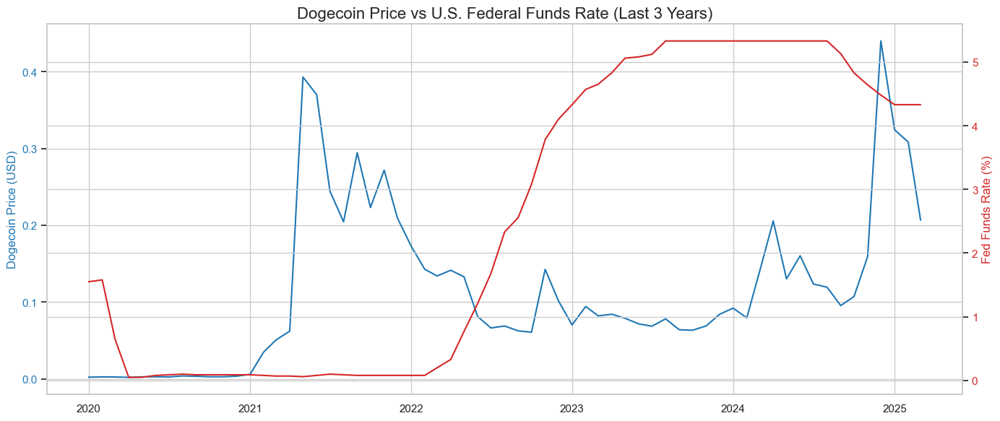
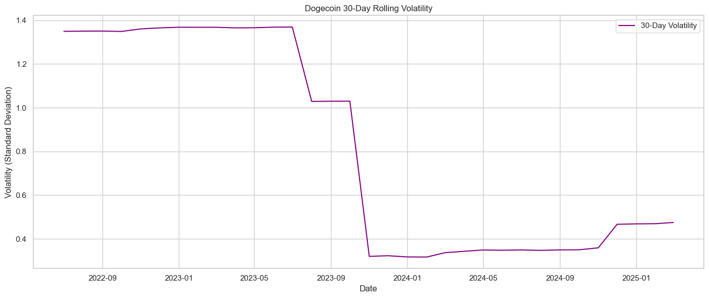
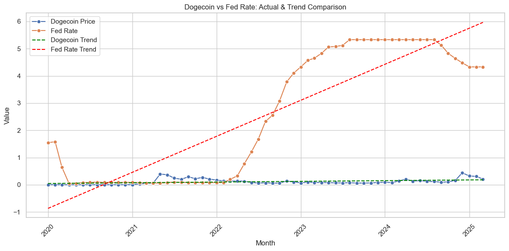

# dogecoin-vs-fed
# Custom BI project analyzing the relationship between Dogecoin price trends and U.S. interest rates over the last 5 years.
# 📊 Dogecoin vs. Fed Interest Rate (2021–2025)

## Section 1. The Business Goal
This project compares the historical performance of **Dogecoin (DOGE)** with changes in the **U.S. Federal Funds Rate** to analyze how cryptocurrency prices respond to monetary policy. Using Python and Power BI, the notebook demonstrates how speculative digital assets interact with traditional financial indicators.

## Section 2. Data Source
 Dogecoin Price Data: Pulled using the yfinance Python library from Yahoo Finance (DOGE-USD)
 Federal Funds Rate: Obtained from FRED (Federal Reserve Economic Data)
 Period Covered: January 2020 – March 2025

## Section 3. Tools Used
 Python (Jupyter Notebook): Data cleaning, transformation, and trend analysis
 Pandas, Seaborn, Matplotlib: Data processing and visualization
 Power BI: Dashboard creation and visualization
 Git + GitHub: Project version control and documentation

## Section 4. Workflow & Logic
ETL:
 Downloaded and merged Dogecoin and interest rate datasets
 Calculated 30-day volatility and month-over-month % changes
 Data Warehouse Output:
 Saved combined and summary tables (combined_doge_fed.csv, master_monthly_summary.csv)
 BI Analysis:
 Sliced by month/year
 Diced by volatility levels
 Trendlines generated using linear regression
 Visualized in Power BI:
 Dogecoin vs Fed Rate Page_1,2,3

## Section 5. Results (narrative + visualizations)
Dogecoin vs Fed Rate Trend :
 Dogecoin shows no linear correlation with interest rates, but both reflect macro-level timing patterns.
Month-over-Month % Change:
 Fed rate changes were gradual; Dogecoin experienced dramatic swings, especially in 2021 and 2023.
Rolling Volatility:
 Highest volatility occurred during meme-stock surges and major rate hike periods.

## Section 6. Suggested Business Action
This project does not constitute investment advice. It was completed for educational purposes to explore how crypto markets like Dogecoin may visually relate to macroeconomic indicators such as U.S. interest rates.
 Possible insights that a business analyst might explore further (not recommendations):
 Crypto platforms could study how interest rate policy aligns with user trading volume.
 Fintech dashboards might consider visualizing macro trends alongside token volatility.
 Investors or analysts may investigate if macro factors have any observable (even if indirect) influence on market confidence.

# Section 7  Challenges
 Despite the late nights, tight deadlines, and countless bug fixes, this project has been a rewarding learning experience. Even under pressure, each challenge helped reinforce real-world BI skills — from data cleaning and transformation to visualization and storytelling. It is not  easy, but seeing it come together made the effort worthwhile. Still tired… but still having fun.

# Section 8. Ethical Considerations. 
This project uses only publicly available data and does not involve any private or sensitive information. 
It is  clear that this is an academic exercise, not a financial model or market predictor and we Avoid misleading interpretations. 
Dogecoin is heavily influenced by non-economic forces (e.g., social media hype). 

## Insights and conclusion

    DOGE price volatility is loosely correlated with rate changes but reflects more speculative behavior.

    Sharp spikes in DOGE don't always align with Fed policy shifts.

    This analysis offers a foundation for exploring market psychology during monetary tightening or easing cycles. Anyway like one of my clasmate wrote 

 
---

## 📈 Visualizations

Here are the core charts generated:

- 📉 **Dogecoin vs Fed Funds Rate (Dual-axis Line Chart)**  
  Monthly time series comparing DOGE closing prices and Fed interest rates

- 🔄 **Monthly Percent Change in DOGE Price**  
  Captures short-term price volatility and shifts in momentum

- 📊 **Trendline Plot with Linear Regression**  
  Predictive-style overlay showing directional trends for both variables

> Visualizations are created using `matplotlib`, `seaborn`, 
> ### Dogecoin vs Fed Funds Rate (Dual-axis Line Chart)

### Monthly % Change in Dogecoin Price

### Trendlines (Regression)

## 📊 Power BI Dashboard Visuals

